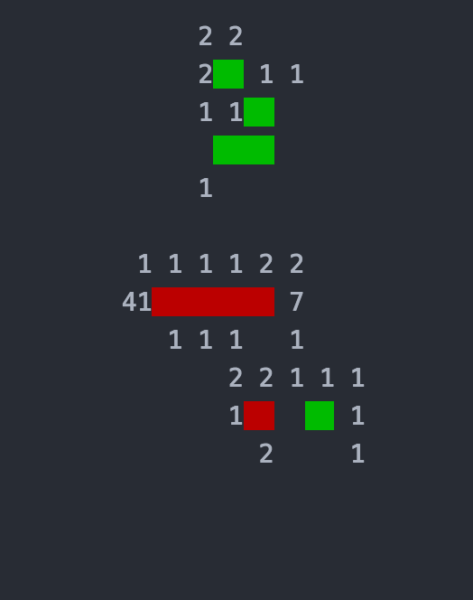
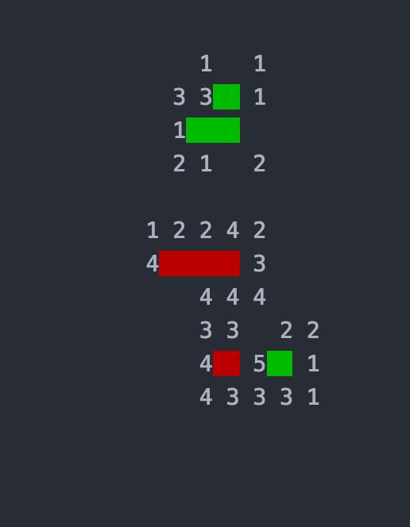
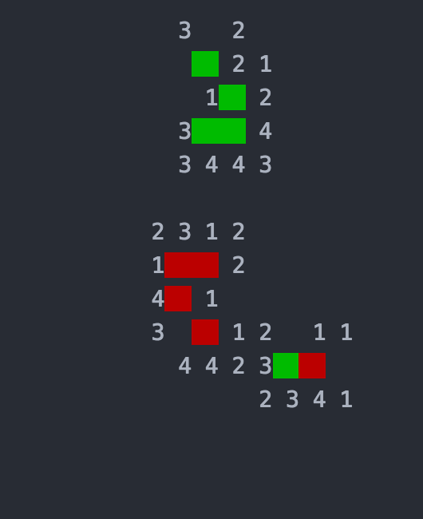
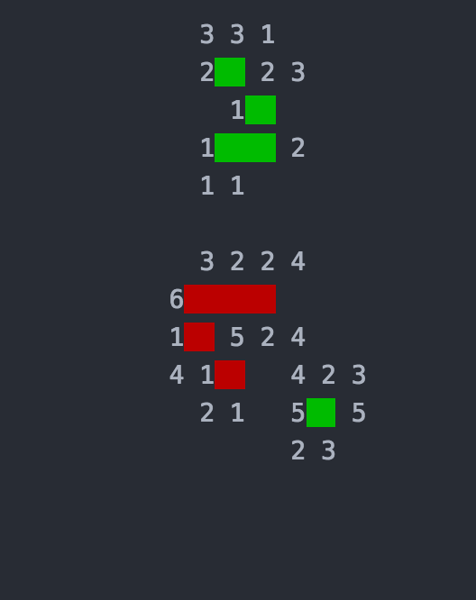
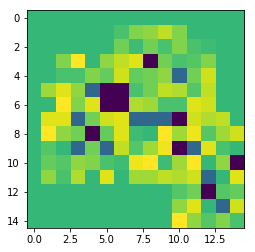
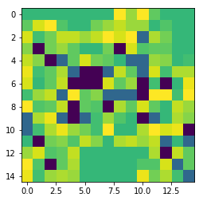

# AlphaGoBang - Implement AlphaZero in Gobang Game

MCTS and RL!

## CURRENT STAGE

Finish MCTS (hope so), with randomly choosen (p, v).

Speed test, single cpu: 13s / step (800 simulations with depth 40)

## MCTS

Monte Carlo tree improvement for Drop strategy in a given situation, with random prior.

Red represents black stones, green represents white stones, the number in the lattice indicates pi%.

* Case 1: open 4
* Case 2: open 3
* Case 3: three-three forbidden hand
* Case 4: four-three

<figure class="half">
    
    

</figure>

<figure class="half">
    
    
</figure>

## SOME RESULTS

Now the MCTS search can find some foolish move (Just better than random)

Blue cells stand for black stones and purple for white. 

Yellow for higher MCTS enhanced policy (based on random prior) and green for 0.  

## Working

* Network.
* Each player play N board simultaneously, and share ONE TREE. THIS greatly speed up the generation of data.
* Multiple player. Unfortunately, tree cannot be reused.
