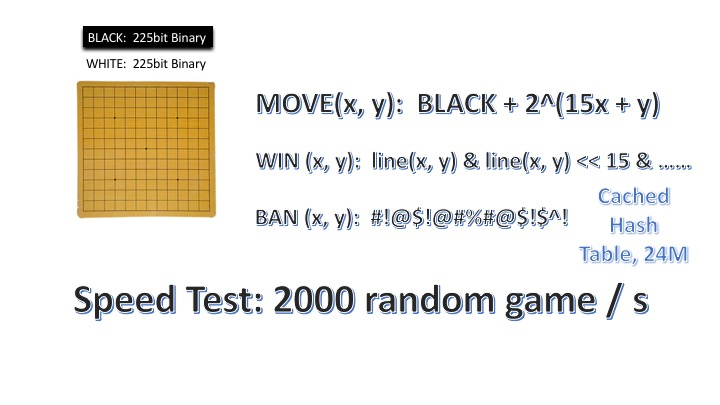

# AlphaGoBang - Implement AlphaZero in Gobang Game

MCTS and RL!

## CURRENT STAGE

(2017.11.2) AI understands open three. 

(2017.10.23) 1s /step (1 process) (200 simulations with depth 45), without network evaluation. Clear MCTS Tree every 100 round for memory reasons. 

(2017.10.21) Finish MCTS (hope so), with randomly choosen (p, v).

(2017.10.21) Speed test, single process: 13s / step (800 simulations with depth 40)

## Working

* Training and self-playing.
