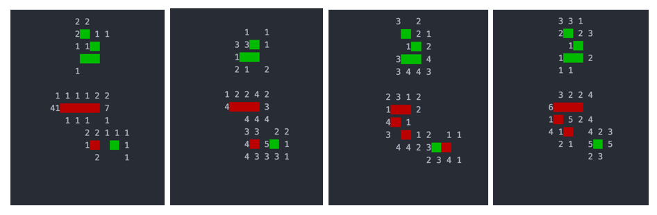

# AlphaGoBang - Implement AlphaZero in Gobang Game

MCTS and RL!

## CURRENT STAGE

(2017.10.23) 1s /step (1 process) (200 simulations with depth 45), without network evaluation. Clear MCTS Tree every 100 round for memory reasons. 

(2017.10.21) Finish MCTS (hope so), with randomly choosen (p, v).

(2017.10.21) Speed test, single process: 13s / step (800 simulations with depth 40)

## MCTS

Monte Carlo tree improvement for Drop strategy in a given situation, with random prior.

Red represents black stones, green represents white stones, the number in the lattice indicates pi%.

* Case 1: open 4
* Case 2: open 3
* Case 3: three-three forbidden hand
* Case 4: four-three

## SOME RESULTS

Now the MCTS search can find some foolish move (Just better than random)

Blue cells stand for black stones and purple for white. 

Yellow for higher MCTS enhanced policy (based on random prior) and green for 0.  

## Working

* Update Player Tree search prior
