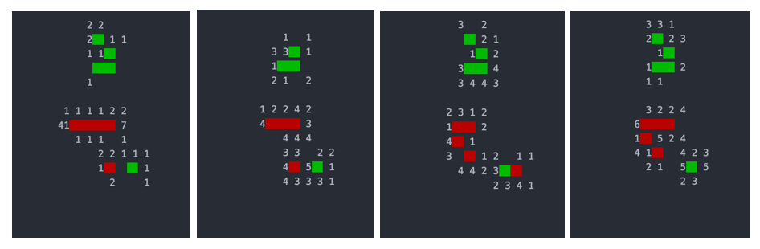

# RESNET and MCTS

## MCTS

Monte Carlo tree improvement for Drop strategy in a given situation, with random prior.

Red represents black stones, green represents white stones, the number in the lattice indicates pi%.

* Case 1: open 4
* Case 2: open 3
* Case 3: three-three forbidden hand
* Case 4: four-three

###Node

###Update

## RESNET